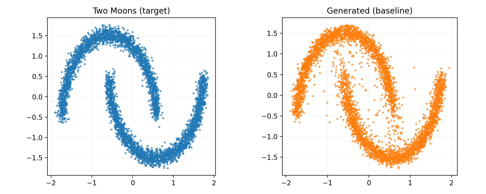

# fal-task

## Two Moons diffusion baseline

This repository contains a minimal test bed for diffusion models on 2D data. The baseline learns the "Two Moons" distribution starting from a standard 2D Gaussian, and uses Diffusers' EulerDiscreteScheduler for generation.

### Model
- **Score network**: `ScoreNet` is a small MLP conditioned on time via sinusoidal embeddings (`diffusers` `Timesteps` + `TimestepEmbedding`).
- **Scheduler (training)**: Discrete DDPM scheduler (`DDPMScheduler`, linear betas, 1000 steps). Training uses the standard ε-prediction objective: the model predicts the added noise and minimizes MSE(ε̂, ε).
- **Sampling (EulerDiscrete)**: Inference uses Diffusers' `EulerDiscreteScheduler` with ε-prediction. The input is scaled via `scheduler.scale_model_input`, and the scheduler performs the reverse update consistent with the discrete DDPM training schedule.

### Training
- Dataset: `sklearn` two moons (50k points).
- Optimizer: AdamW, optional gradient clipping.
- Defaults: `--train-steps 5000`, batch size 512.
- A checkpoint is saved to `artifacts/checkpoints/baseline.pt`.

### Sampling (EulerDiscrete)
Starting from `N(0, I)`, we run Diffusers' `EulerDiscreteScheduler` from `t=1 → 0` using ε-prediction. Inputs are scaled with `scheduler.scale_model_input`, and updates follow the discrete DDPM schedule. Defaults: `--sample-steps 1000`, `--num-samples 5000`.

### Evaluation metrics
For quantitative validation against the target two-moons samples, the pipeline reports:
- **MMD (RBF, multi-bandwidth around median heuristic)**
- **Energy Distance**
- **Sliced Wasserstein-1** (average over random 1D projections, L=256)

### How to run
```bash
pip install -r requirements.txt
python main.py --run
```
Key outputs:
- Samples: `artifacts/outputs/samples.pt`
- Plot: `artifacts/plots/baseline_two_moons.png`
- Metrics printed to stdout

### Result


### Baseline (40k steps)

- **Command** (40k steps, batch size 512, lr 1e-3, 1000 sample steps, 5k samples, seed 42):
  ```bash
  python main.py --run --train-steps 40000 --batch-size 512 --lr 1e-3 --log-every 500 --sample-steps 1000 --num-samples 5000 --seed 42
  ```

- **Metrics** (lower is better):

  | Setting  | MMD (RBF) | Energy Distance | Sliced Wasserstein-1 (L=256) |
  |----------|-----------|-----------------|-------------------------------|
  | Baseline | 0.043403  | 0.059351        | 0.053859                      |

- **Artifacts**:
  - Comparison plot: `artifacts/plots/baseline_two_moons.png`
  - Generated-only plot: `artifacts/plots/baseline_two_moons_generated.png`

### EMA (optional)
- **What it does**: Tracks an exponential moving average (EMA) of weights during training and optionally uses EMA weights for sampling.
- **How to enable**:
  - Add `--train-use-ema` to enable EMA tracking during training (decay via `--ema-decay`, default `0.999`).
  - Add `--sample-use-ema` to prefer EMA weights when loading for sampling.
- **Note**: EMA typically improves sample quality and distance metrics; exact numbers may vary.
