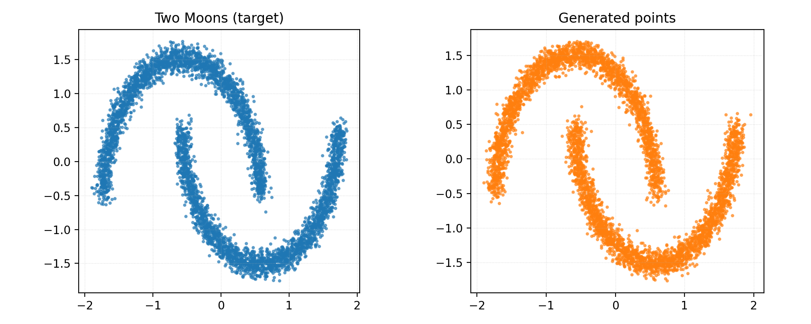

# fal-task

## Diffusion Models for Two Moons Distribution

A minimal test bed for diffusion models on 2D data. Trains a score network on the "Two Moons" dataset and samples using a discrete DDPM scheduler.



See the full write-up: [Write-up](fal_writeup.pdf).

### Setup

```bash
uv venv
source .venv/bin/activate
uv pip install -r requirements.txt
```

### How to run

- Full pipeline (train → sample → evaluate → plot):
```bash
python main.py --run --train-steps 40000 --batch-size 512 --lr 1e-3 --log-every 500 --sample-steps 1000 --num-samples 5000 --seed 42 --train-use-ema --sample-use-ema
```

### Parameters

- `--train-steps` (int, default: 40000): Number of training optimization steps.
- `--batch-size` (int, default: 512): Batch size for training.
- `--lr` (float, default: 1e-3): AdamW learning rate.
- `--log-every` (int, default: 250): Progress logging frequency (steps).
- `--sample-steps` (int, default: 1000): Number of DDPM steps during sampling.
- `--num-samples` (int, default: 5000): Number of points to generate and evaluate.
- `--seed` (int, default: 42): Random seed for reproducibility.
- `--train-use-ema` (flag): Track EMA of weights during training and save EMA weights.
- `--sample-use-ema` (flag): Prefer EMA weights when loading for sampling (if available).
- `--ema-decay` (float, default: 0.999): EMA decay used when `--train-use-ema` is set.
- `--skip-train` (flag): Skip training; only sample/evaluate an existing checkpoint if present.
- `--run` (flag): Execute the end-to-end pipeline.

### Outputs
 
- Checkpoint: `artifacts/checkpoints/baseline.pt`
- Samples (tensor): `artifacts/outputs/samples.pt`
- Plots:
  - `artifacts/plots/two_moons.png` (generated vs target)
  - `artifacts/plots/two_moons_generated.png` (generated only)